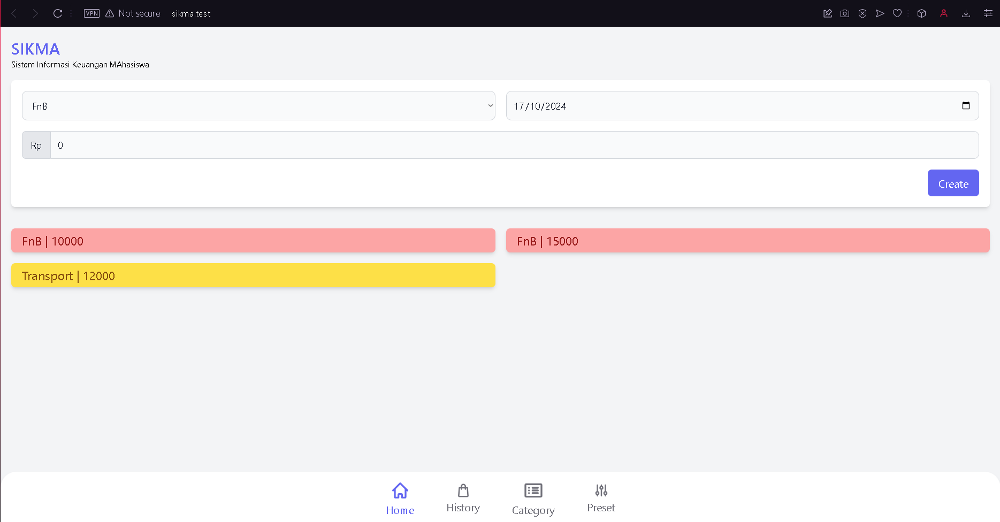
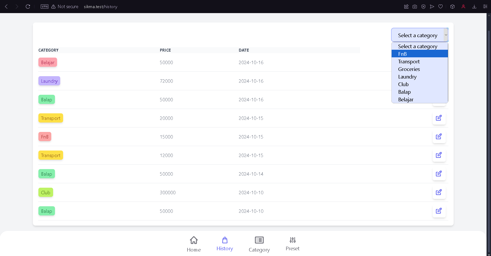
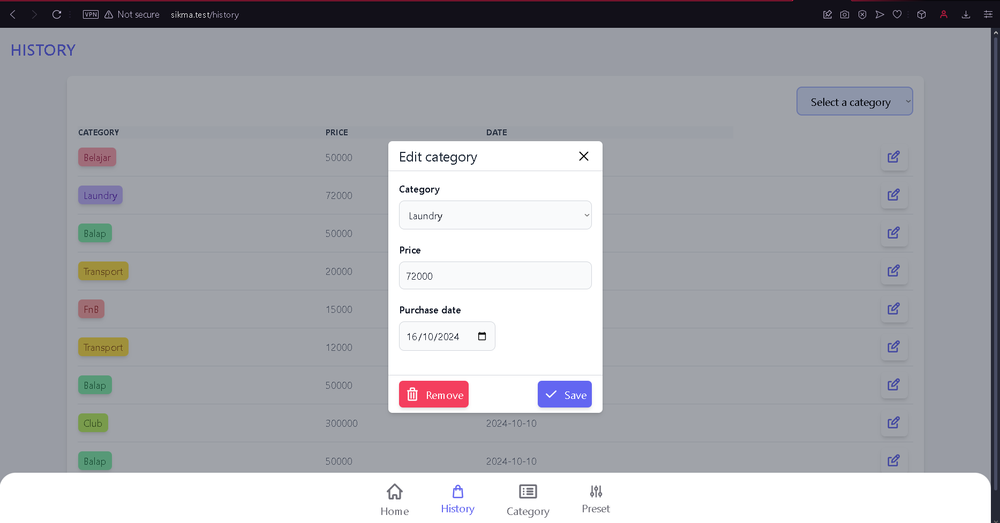
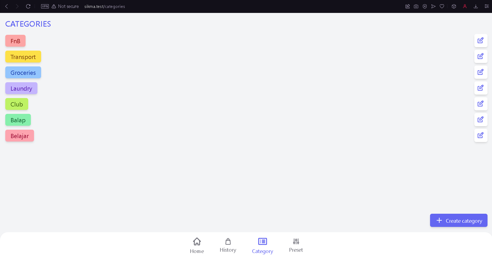

# SIKMA
## Sistem Informasi Keuangan MAhasiswa
{{project about}}

### To use this project
From the github repo webpage click code then 'Open in GitHub Desktop', let the app open and find the proper location you want to put it. Open the terminal on the project directory.
1. <code>composer update</code>
2. <code>cp .env.example .env</code>
3. create  <code>database.sqlite</code> file in the database directory
4. <code>php artisan key:generate</code> 
5. <code>php artisan migrate:fresh --seed</code> 
6. <code>npm install</code> 
7. <code>npm run dev</code> 

### Features
### Home Page


On the home page there are several fucntioning features for the user to made an entry for their expenses, which is:
#### 1. Category Selection
```php
<select wire:model="category_id" class="bg-gray-50 w-1/2 border border-gray-300 text-gray-900 text-sm rounded-lg focus:ring-blue-500 focus:border-blue-500 block p-2.5 y-600">
    @foreach ($categories as $category)
        <option value="{{$category->id}}">{{$category->name}}</option>
    @endforeach
</select>
```
A dropdown menu allows the user to select a category (e.g., FnB, Transport). This selection is done using the category_id field, populated dynamically using a loop `(@foreach)` that generates options based on categories fetched from the server. 

#### 2. Date Selection
```php
<input wire:model="date" type="date" class="bg-gray-50 w-1/2 border border-gray-300 text-gray-900 text-sm rounded-lg focus:ring-blue-500 focus:border-blue-500 block p-2.5" value="{{date('Y-m-d')}}">
```
There is a date picker where users can select the date of the financial entry. It defaults to the current date, as shown by the `value="{{date('Y-m-d')}}"` in the input.

#### 3. Price Input
```php
<div class="flex">
    <span class="inline-flex items-center px-3 text-sm text-gray-900 bg-gray-200 border border-gray-300 border-e-0 rounded-s-md ">
      Rp
    </span>
    <input type="numeric" wire:model="price" class="rounded-none rounded-e-lg bg-gray-50 border border-gray-300 text-gray-900 focus:ring-blue-500 focus:border-blue-500 block flex-1 min-w-0 w-full text-sm p-2.5">
</div>
```
The user can input the price of the transaction in Indonesian Rupiah (Rp). It displays an "Rp" prefix to indicate currency. This field is bound to the price model using Livewire's `wire:model directive`.

#### 4. Error Handling for Price Input
```php
@error('price')
    <span class="text-xs text-red-500">{{$message}}</span>
@enderror
```
This part shows a validation error if there’s an issue with the price input (e.g., empty or invalid input). The `@error('price')` directive is used to display the error message.

#### 5. Success Message
```php
@if ($successMessage)
    <div x-data="{ show: true }" x-show="show" x-init="setTimeout(() => show = false, 3000)" class="p-2 text-white bg-green-500 rounded">
        {{ $successMessage }}
    </div>
@endif
```
If an entry is successfully created, a success message is displayed temporarily for 3 seconds using Alpine.js. The message is stored in the `$successMessage` variable.

#### 6. Submit Button
```php
<button type="submit" class="px-4 py-2 text-white bg-indigo-500 rounded-md w-fit">
    Create
</button>
```
A Create button triggers the form submission. When the button is clicked, the StoreEntry method is called to handle the form data and save the entry.

#### 7. Preset Entry
```php
<div class="grid grid-cols-2 w-full gap-4">
    @forelse ($presets as $preset)
    <button wire:click="EntryStore({{ $preset }})" class="bg-{{ $preset->category->color }}-300 text-{{ $preset->category->color }}-800 text-left px-4 py-1 rounded-md shadow-md text-lg">
        {{$preset->category->name}} | {{ $preset->price }}
    </button>
    @empty

    @endforelse
</div>
```
A submit button for already made presets to simplify for user to create an Entry without entering each data one-by-one.

### History Page


Several features are available in the history page to help user see the expenses they made throughout using the application

#### 1.Category Filtering Dropdown
```php
<div x-data="{ selectedCategory: @entangle('selectedCategories') }">
    <select x-model="selectedCategory" x-on:change="$wire.filterEntries()"
        class="block px-4 py-2 bg-indigo-100 border-2 border-indigo-300 rounded-lg cursor-pointer">
        <option value="all">Select a category</option>
        @foreach ($categories as $category)
            <option value="{{ $category->id }}">{{ $category->name }}</option>
        @endforeach
    </select>
</div>
```
This feature allows users to filter table entries based on the selected category from the dropdown. The selected category is dynamically bound using `Alpine.js (x-data)` and `Livewire ($wire)`.

This dropdown binds the selected category to Livewire’s backend component using `@entangle('selectedCategories')`.
When the user selects a category, `filterEntries()` is triggered to refresh the table with filtered data.

#### 2. Entries Table
```php
@foreach($entries->sortByDesc('date') as $entry)
    <tr>
        <td>
            <span style="background-color: {{ $entry->category->color ?? 'gray' }}; color: {{ $entry->category->color ?? 'gray' }}">
                {{ $entry->category->name ?? 'not set' }}
            </span>
        </td>
        <td>{{ $entry->price }}</td>
        <td>{{ $entry->date }}</td>
    </tr>
@endforeach
```
The table displays the filtered entries based on the category and shows relevant details such as category, price, and date. Entries are sorted in descending order by date. 

The `@foreach` loop dynamically generates the rows based on the entries data from the Livewire component.
Each entry shows the category with a color label, the price, and the date.
Entries are sorted by date in descending order using `sortByDesc('date')`.

#### 3. Edit Form


```php
@if ($form == 'editing')
    <select wire:model="category_id">
        @foreach ($categories as $category)
            <option value="{{ $category->id }}">{{ $category->name }}</option>
        @endforeach
    </select>
    
    <input type="text" wire:model="price" placeholder="Price" />

    <input type="date" wire:model="date" />

    <button wire:click="EntryDelete">Remove</button>
    <button wire:click="EntryUpdate">Save</button>
@endif

```
The form enables users to edit an entry’s category, price, and date. It is triggered when the user selects an entry for editing.

The `modal` allows users to modify the entry's details. It appears conditionally when `$form` is set to 'editing'.
Inputs for category, price, and date are bound to the Livewire component using `wire:model`.

#### 4. Entry Update and Delete Buttons
```php
<button wire:click="EntryDelete" class="flex items-center px-2 py-2 text-white bg-rose-500 rounded-md shadow-md gap-x-2">
    Remove
</button>
<button wire:click="EntryUpdate" class="flex items-center px-2 py-2 text-white bg-indigo-500 rounded-md shadow-md gap-x-2">
    Save
</button>
```
The buttons within the modal allow users to save changes (update the entry) or delete the entry. The `wire:click` directive binds the button clicks to Livewire methods. `EntryDelete` removes the entry, and `EntryUpdate` saves the changes.

### Category Page


This page usage are to display the current available category in the app, user can create new category if needed and delete if not.

#### 1. Listing Categories
The code uses the `@forelse` directive to loop through the available categories. If there are no categories, a fallback message `("You have not set any category")` is displayed.
```php
@forelse ($categories as $category)
    <div>
        <span>{{ $category->name }}</span>
        <button wire:click="CategoryShow({{ $category }})">Edit</button>
    </div>
@empty
    You have not set any category
@endforelse
```
Each category has a label styled using its color, which is dynamically set with Tailwind CSS. The color is defined by the category's properties `($category->color)`.
Next to each category, there’s an edit button (pencil icon) to trigger editing for that category.

#### 2. Creating a New Category
A button is available at the bottom-right corner of the screen that, when clicked, triggers a modal to create a new category.
```php
<button wire:click="CategoryCreateForm">Create category</button>
```
The button for creating a new category is fixed in the bottom-right, styled with Tailwind classes.
Inside the modal, the user inputs the category name and selects a color from a dropdown.
When the user clicks "Create," the `CategoryStore` function is triggered, storing the new category.

#### 3. Editing a Category
When clicking on the pencil button next to a category, the `CategoryShow` function is triggered, showing the category in edit mode.
```php
@elseif ($form=='editing')
    <input type="text" wire:model="name" placeholder="Edit Category Name" />
    <select wire:model="color">
        @foreach ($colors as $color)
            <option value="{{ $color }}">{{ $color }}</option>
        @endforeach
    </select>
    <button wire:click="CategoryDelete">Remove</button>
    <button wire:click="CategoryUpdate">Save</button>
@endif
```
A modal similar to the create form opens, but this time it allows the user to modify the name and color of the category.
A "Save" button is provided, triggering the `CategoryUpdate` function, and a "Remove" button allows for category deletion with `CategoryDelete`.

### Preset Page


Preset page are available for user to create a regular expenses without making a new entry.

#### 1. Displaying Presets
This feature iterates over the available presets and displays each preset with its associated category name and price. If no presets are available, a message is shown.
```php
@forelse ($presets as $preset)
    <div>
        <span>{{$preset->category->name}} | {{ $preset->price }}</span>
    </div>
@empty
    You have not set any preset
@endforelse
```

#### 2. Button to Show Preset Details
Each preset has a button that, when clicked, triggers the `PresetShow` function to display more details about the selected preset.
```php
<button wire:click="PresetShow({{ $preset }})">
    Show Details
</button>
```

#### 3. Button to Create Preset
This button opens a modal form to create a new preset. It uses the `PresetCreateForm` function when clicked.
```php
<button wire:click="PresetCreateForm">
    Create preset
</button>
```

#### 4. Creating a Preset
This modal includes inputs for price and category. When the form is submitted, it calls the `PresetStore` function to save the new preset.
```php
<input type="text" wire:model="price" />
<select wire:model="category_id">
    @foreach ($categories as $category)
        <option value="{{ $category->id }}">{{ $category->name }}</option>
    @endforeach
</select>

<button wire:click="PresetStore">
    Create
</button>
```

#### 5. Editing a Preset
When editing a preset, the modal displays the preset's details in disabled input fields. The `PresetDelete` function is called to remove the preset when the corresponding button is clicked.
```php
<input type="text" disabled wire:model="price" />
<input type="text" disabled wire:model="category_id" />

<button wire:click="PresetDelete">
    Remove
</button>
```